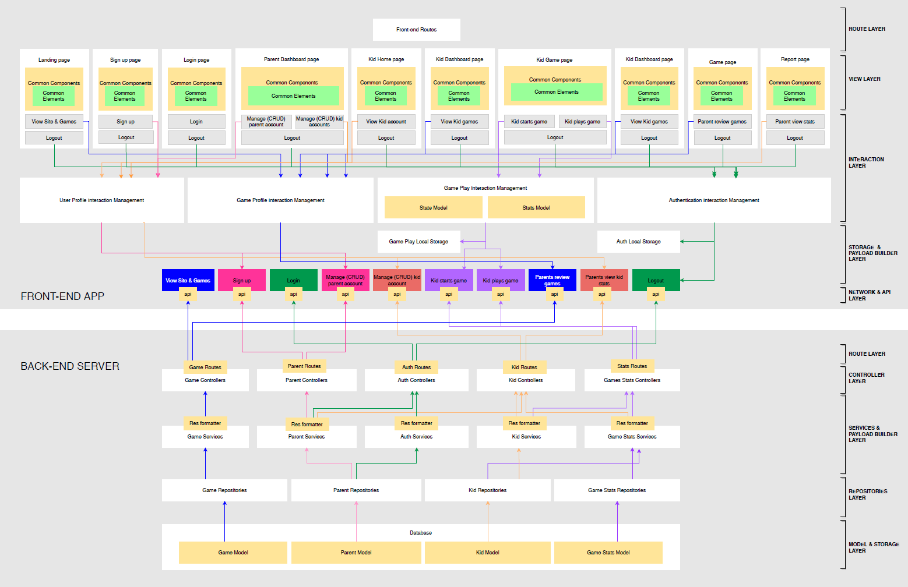

# Readme

Project Collaborator
1) Tam 
2) Lina
3) Yue Jia

# App Title - TLY Education app 

This application is a website that provides educational games for kids to learn in a interactive and engaging way. Data is collected through the games and send to parents in order to review and have a better understanding of their kid learning journey.

## Application link "

- (link to application)

## Table of Contents
- [Introduction](#Introduction)
- [Project Approach](#project-approach)
- [Technology Used](#Technology-used)
- [Main Features](#Main-features)
- [User Journey Map](#User-Journey-Map)
- [Developer Journey](#Developer-Journey)
- [Future Development](#Future-Development)

# Project scope


## Introduction

Let's admit it, we struggled to keep up with children who seems to possess an unsurmountable amount of energy from a mysterious source. Parents often find screen as a easy way and effective solution to keep children occupied, granting parents the precious time to perform their task or simply to recharge energy lost. 

Current generation parents also need to juggle between work and managing their child's learning journey. It is a common struggle among parents to be physically managing both. This is especially true in the midst of COVID-19 pandemic where major activities are largely at home like  Parent's (Work From Home) wfh status and Home-Based Learning for children.

As social media tools such as tiktok and youtube become more accessible by children, It is increasingly a worrying sign as a child may be exposed to unfiltered and not child-friendly contents in such site. Over-reliant on using screen to keep children occupied also decreases parent-child interaction.

As such, more educational companies are pouring resources and energy to create digital products that keeps children engaged and learning at the same time. With a good system, it can help parent better manage their child's home-based learning , making children's screentime purposeful and help parent to juggle between managing children and work at home. 

### This application therefore aims to achieve 3 objectives:

- 1) the educational application has to engage and trigger a child's learning journey.

- 2) Display data collection from the children engagement with the app to provide parent with insights to their child's learning journey

- 3) The app does not seek to prolong the amount of screen-time but aims to make more meaningful screen-time for the child. In this case, learning while having fun. 

### In view of this, the application developed aims to 
1) Target at matured gamers
2) Have a system of setting personal account and able to post their information and view other people's account. 

## Project Approach

The approach to this project is to set up a basic MVC structure with all CRUD routes created and MONGODB connected for a single user. User's homepage, contentpage, viewpage, editpage and postpage to be created for a single User.

Set up database and Schema validation in a way that when user sign in, it will retrieved database corresponding to its username. 

Secondly, built authentication for a single user to retrieve its own information.

Next, build main application page where all user's basic info and latest post is displayed. Upon entering the post, Users can view all post posted by that users. 

Other users can post comments other other user's viewpages. 

BONUS : include password authentication and adding a social list. 

## Technology used

1) MERN stack architecture
2) MVC structure
3) Axios
4) Passport JS 
5) Cors
6) Heroku (for deployment of application)
7) Mongo Atlas ( for storing databases on cloud platform)
8) MDBReact (minimal usage) 
9) CSS (no framework)
10) React-Spring
11) Rough-Chart JS
11) External source
    - (if any, to be added)

## MVP

### New
- CSS new framework. To create our own framework
- MDBReact. Minimal usage for css library
- Rough-Chart JS. To display statistic. 
- react-spring. For Game interaction. 
- react-use-gesture. Gesture interaction.
- lodash. managing Array and numbers 
- React state control.  useContext / Redux / Reducer

### Main Features ( MVP )
#### backend
- CRUD method for 4 library structured as such Child / Parent / Game / GameStat
- Authentication layer using PassportJs to authenticate User. 
- Mongoose Data Schema for each library
- Structured as below [see MVC structure below]

#### frontend
- Game creation with logic and algorithm. 
- Recoriding statistic and displaying on each childreport page accessible ONLY to parent


## DATA STRUCTURE


## User Journey Map

1) LandingPage. Parent learn about the application or log in for registered user. 

2) 

3) Dashboard **DASHBOARDPAGE**

    DISPLAY
    - User can see their own post
    - Side nav bar to direct to  
        1) Dashboard - direct to **DASHBOARDPage** 
        2) sign out - sign the users out and redirect to **HOMEPAGE**
        3) Post - directs to **NEWPOSTpage**
    - Search option bar to search within their own post. 
    - Sort option to sort by latest feed / Title Alphabetical order
    - (BONUS) A side nav that shows their recent activity ( up to 10 items)
    
    INTERACTION
    - For each post, user can EDIT / DELETE / SHOW on that particular post
        - for EDIT - **editPage** which add content onto the existing post or edit page
        - for DELETE - **delete** which deletes the entire post
        - for SHOW -- **showPage** which shows the post's entire detail


4) Posting New content **NEWPOSTpage**

    DISPLAY
    - a form div that user can input new content with fields such as
        - REQUIRED
            - Title
            - add main image (one url link)
            - Genre (select options) (Walkthrough / Reviews / Challenges / Tips & Tricks)
            - add tags (add on options) ("#game title", "#question", "#stucked", "#experiences" and etc)
            - Description (textarea)

        - NON-REQUIRED
            - sub images(can add as many images as user pleases)
            - sub description
            - external link
    - Submit button

    INTERACTION
        - User can key in information and click the submit button. 
        - Upon submission, it will redirect to user's dashboard page

5) Editing content on existing post **editPage** 

    DISPLAY
    - Information about current post to be display with the option to delete / edit / add-on
        - For required field
            - Able to edit
        - For Non-required field
            - able to delete / edit / add-on
    - Comments about the post are displayed and can be deleted but not edited.

    INTERACTION
    - User can input edit and delete information regarding the post
    - A save button to finalize and submit all updates.
    - A back button to cancel the session and return to user's Dashboard
    - A Home button to direct to homePage
    
6) Showing a Post **showPage**

    Display
    - A div block that display all information about the post
    - An input (textarea) bar to post comment on the post
    - A add button to add an image 
    - A delete button to delete post
    - A edit button to edit post (redirects to editPage)
    
    INTERACTION
    - User can see the most recent comment. 
    - User can post his own comment in response to that comment made by other users.

7) 

## Data Structure

DATABASE NAME : ``` gameMeetup ```

Datas will be structured into two collections.
- 'user' collections which will store user's information such as name, email, password, date created and date that infomation is updated.
- 'infoBank' collections which will store every user's data which include arrays of feeds, and each feed would have elements such as title, images, descriptions and comments.  


1) User's schema structure as :
    ```
    {
        $jsonSchema: {
            type: 'object',
            required:['username','nickname','email','password'],
            properties: {
                username: {
                    bsonType: 'string'
                },
                nickname: {
                    bsonType: 'string'
                },
                email: {
                    bsonType: 'string'
                },
                password: {
                    bsonType: 'string'
                },
                createdAt: {
                    bsonType: 'date'
                },
                updatedAt: {
                    bsonType: 'date'
                }
            }
        }
    }
    ```

2) 'infoBank's schema structure as :
    ```
    {
        $jsonSchema: {
            type: 'object',
            required:['username','nickname'],
            properties: {
                username: {
                    bsonType: 'string'
                },
                nickname: {
                    bsonType: 'string'
                },
                loggedInAt: {
                    bsonType: 'date'
                },
                feeds: {
                    bsonType: 'array',
                    uniqueItems: true,
                    items: {
                        bsonType: 'object',
                        properties: {
                            postID: {
                                bsonType: 'number',
                                description: 'index of post'
                            },
                            title: {
                                bsonType: 'string',
                                description: 'the title of the feed'
                            },
                            img: {
                                bsonType: 'string',
                                description: 'the main image url'
                            },
                            description: {
                                bsonType: 'string',
                                description: 'description of your feed'
                            },
                            tags: {
                                bsonType: 'array',
                                uniqueItems:true,
                                items: {
                                    bsonType: 'string',
                                    description: 'tags of your post for search filters'
                                }
                            },
                            postedAt:{
                                bsonType: 'date',
                                description: 'date of new post created'
                            },
                            editedAt: {
                                bsonType: 'date',
                                description : 'date of updated post'
                            },
                            comments: {
                                bsonType: 'array',
                                uniqueItems: true,
                                items: {
                                    bsonType: 'object',
                                    required:['commentBy','commentAt',commentInfo],
                                    properties: {
                                        commentBy : {
                                            bsontype: 'string',
                                            description: 'the person who commented'
                                        },
                                        commentAt : {
                                            bsontype: 'date'
                                            description: 'date posted'
                                        },
                                        commentInfo : {
                                            bsontype: 'string',
                                            description: 'desciption of the post'
                                        },
                                        commentImg: {
                                            bsontype: 'string',
                                            description: 'uploading images related to post'
                                        }
                                    }
                                }
                            }
                        }
                    }
                }
            }
        }
    }
    ```
    


// comment stucture
// post stucture

name: user A
post:{details of post with the comment nested in.}
a userid that tags to the comment


documents which are user
documents which are post. 

name: user A
post ['id1, id2]

post data
id1: {
    details of the post
}

// authentication is lower priority. use dropdown list of created users. 


