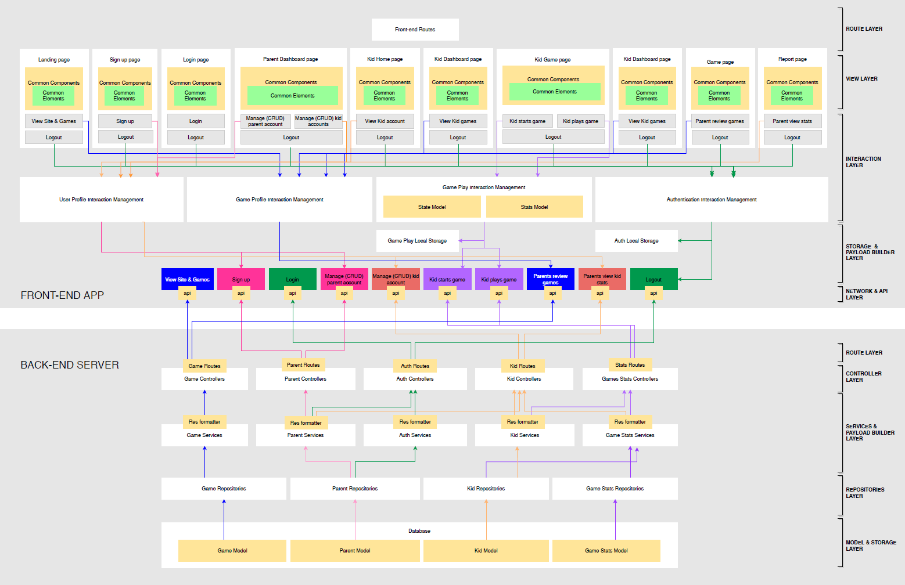

# TLY EDUCATION APPLICATION
Project Collaborator
1) Tam 
2) Lina
3) Yue Jia

This application is a website that provides educational games for kids to learn in a interactive and engaging way. Data is collected through the games and send to parents in order to review and have a better understanding of their kid learning journey.

## Application link
- FrontEnd repo : https://github.com/leeyuejia/project_4_FE
- BackEnd repo : https://github.com/leeyuejia/project_4_BE
- FrontEnd Link : https://tly-education-fe.herokuapp.com/
- BackEnd Link : https://tly-education-be.herokuapp.com/

## Table of Contents
- [Introduction](#Introduction)
- [Technology Used](#Technology-used)
- [Main Features](#Main-features)
- [User Journey Map](#User-Journey-Map)
- [Developer Journey](#Developer-Journey)
- [Future Development](#Future-Development)
- [Project Post Mortem](#Project-Post-Mortem)

# Project scope

## Introduction

Let's admit it, we struggled to keep up with children who seems to possess an unsurmountable amount of energy from a mysterious source. Parents often find screen as a easy way and effective solution to keep children occupied, granting parents the precious time to perform their task or simply to recharge energy lost. 

Current generation parents also need to juggle between work and managing their child's learning journey. It is a common struggle among parents to be physically managing both. This is especially true in the midst of COVID-19 pandemic where major activities are largely at home like  Parent's (Work From Home) wfh status and Home-Based Learning for children.

As social media tools such as tiktok and youtube become more accessible by children, It is increasingly a worrying sign as a child may be exposed to unfiltered and not child-friendly contents in such site. Over-reliant on using screen to keep children occupied also decreases parent-child interaction.

As such, more educational companies are pouring resources and energy to create digital products that keeps children engaged and learning at the same time. With a good system, it can help parent better manage their child's home-based learning , making children's screentime purposeful and help parent to juggle between managing children and work at home. 

### This application therefore aims to achieve 3 objectives:

- The educational application has to engage and trigger a child's learning journey.

- Display data collection from the children engagement with the app to provide parent with insights to their child's learning journey

- The app does not seek to prolong the amount of screen-time but aims to make more meaningful screen-time for the child. In this case, learning while having fun. 

## Technology used

1) MERN stack architecture
2) MVC structure
3) Axios
4) Passport JS 
5) Cors
6) Heroku (for deployment of application)
7) Mongo Atlas ( for storing databases on cloud platform)
8) MDBReact (minimal usage) 
9) CSS (no framework)
10) React-Spring
11) Rough-Chart JS
11) External source
    - (if any, to be added)

## Main Features

### New MVP
- CSS new framework. To create our own framework
- MDBReact. Minimal usage for css library
- Rough-Chart JS. To display statistic. 
- react-spring. For Game interaction. 
- react-use-gesture. Gesture interaction.
- lodash. managing Array and numbers 
- React state control.  useContext / Redux / Reducer

### Features
#### backend
- CRUD method for 4 library structured as such Child / Parent / Game / GameStat
- Authentication layer using PassportJs to authenticate User. 
- Mongoose Data Schema for each library
- Structured as below [see MVC structure below]

#### frontend
- Game creation with logic and algorithm. 
- Recoriding statistic and displaying on each childreport page accessible ONLY to parent

## DATA STRUCTURE

## User Journey Map

1) LandingPage. Parent learn about the application or log in for registered user. 

2) Register. Parent register an account for themselves. 

3) Game Infopage. Games information would be displayed here to inform Parent the games available. 

4) Log In. Parent log in and redirects to dashboard page. 
 - Local storage will store parent data
 - Backend passportJS will register parentData. Req.user would contain logged In parent Data. 
 - Context Provider will provide AuthenticatedUser throughout the app wrapped in Provider. 

5) On Homepage. A Child will have access to their own profile by clicking on their avatar.

// screenshot

6) Child Game page. A Child would be able to select the game available. They can also see the latest game they have played. 

// screenshot

7) Gameboard. Each game would have a formatted initial button.
 - After Each gameplay, statistic would be captured and send to backend. 
 - Each submission sends data that involves, game score, number of tries, games title played, completion rate and game comparison. 

 // screenshot of gameboard

8) Parent DashboardPage. Page view ONLY for parent.

- Parent need to input acct password in order to access dashboard. 
// screenshot of input password
- Parent can do CRUD operation for a child here. Adding / Editing or Graduating (Delete) a child data. 
// screenshot of parentDashboard
// screenshot of adding child (Modal pop up)

9) Child ReportPage. For Parent to view each Child statistic. Here display A child performance on all games and comparison between each game. 
// screenshot of child report page. 

10) Log Out. Upon logging out, Parent localstorage would be deleted. *Application - As long as parent do not log out, a child can have access to games even when browser is close. or for another day's session. This is to facilitate self learning when parent are not physical present. 

## Developer Journey

1) ### SETUP

Our team define our MVP and set up to define our data schema structure to fit our MVP, including bonus item that we want to achieve. We decided on 4 data collection for 4 specific purpose, ie. Parent, Kid, Game and GameStat. Using ObjectID to link relation with across each collection.  

The team proceed to split task with one person setting up Backend which include, backend route CRUD for each collection ,data Schema and formatting response. While another person start to setup FrontEnd view structure with basic routing page and folder structure. Naming of routes were kept as simple as possible to maintain readability. As games consume most of the time, another person started on creating game.

As each member proceed with backend, frontend and content creation, structure was built and optimized to provide foundation along the way to make addition easier to read and locate as codes become bigger. By the end of the basic setup, we have a architecture framework which we follow to build upon. Minor changes were inevitable but the framework remains. 

2) ### BUILDING

Game content creation is ongoing while another starts to integrate CRUD function and authentication layer from backend to frontend. This part focus on building a friendly user interaction for user, optimizing user experience. Elements like buttons, inputs and game component were built and styled to share across the application. Game content starts to integrate with the app giving a rough sketch of a complete user journey. 

3) ### OPTIMIZING

Game content creation is continously generated. A member process to scan through both backend and frontend and starts to refactor and optimize code to adhere to intented architecture framework.
De-bugging stage starts from here as refactoring and optimizing code could cost bugs everywhere. Application's styling was also made consistent throughout the application. Child Statistic page was also built at this stage. Logic for extracting gamedata and presented on client side was built. 

4) ### TESTING AND DEBUGGING

The following was tested and debugged. 
- Game play
- CRUD route for child
- Authentication both FrontEnd and BackEnd
- Gamedata stats
- Minor bug across the application

5) ### DEPLOYMENT

Backend and Frontend was deployed on Heroku. Once successfully deployed, the team run through another round of testing and debugging. Documentation started at this point. 

## Future Development

It is our hope that in the future, this application would be open-source for game enthusiats to design educational games to be added into this application. This is to increase the library of education games available to child and also a central collection of educational games created by programmers.

### Bonus feature (if have time)
- Google Auth
- Using canvas to program a javascript game embeded onto REACT
- Using mySQL-type database
- A developer account to add games they have developed and embed unto this application. (BONUS BONUS)

## Project Post Mortem

1) What went well?

2) What could be better?

3) What do you wish for?

4) What is the next step? 
